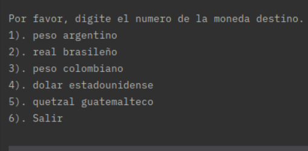
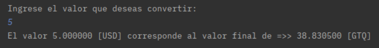
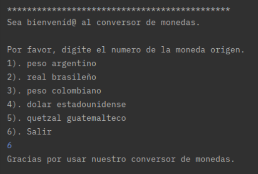
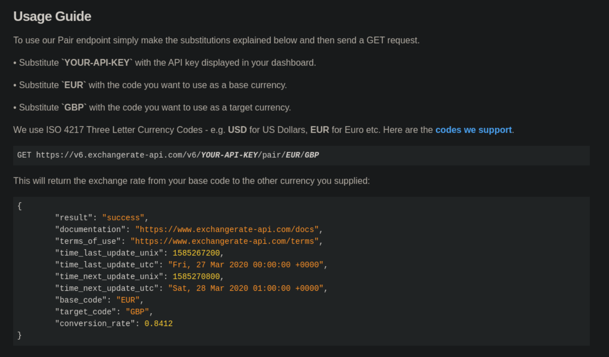

# Conversor de monedas.
## Uso de la aplicación.
Esta aplicación de consola de un conversor de moneda permite hacer la conversion entre las siguientes monedas:
1. Peso argentino.
2. Real brasileño.
3. Peso colombiano.
4. Dólar estadounidense.
5. Quetzal guatemalteco.

Al iniciar la aplicación esta dará un mensaje de bienvenida y le listará las monedas disponibles como moneda origen (aquella moneda en la cual tiene su dinero).

Seguidamente, esta le permitirá escoger la moneda destino (aquella moneda a la cual desea convertir su dinero).

Para continuar, se le pedirá que digite el monto a convertir y al pulsar la tecla **ENTER** se mostrará la conversión.

El programa entrará en un bucle infinito hasta que elija la opción de *Salir*. Verá un mensaje de despedida y el programa se cerrará.

## Funcionamiento interno.
Esta aplicación hace uso de la API [ExchangeRate-API](https://www.exchangerate-api.com/).
Como al usuario se le da la oportunidad de hacer una conversión de y hacia todas las monedas listadas previamente, se sabe con certeza cuál es la moneda origen y cuál es la moneda destino de la operación por lo que se utiliza [Pair Conversion](https://www.exchangerate-api.com/docs/pair-conversion-requests) para obtener el tipo de cambio al momento y multiplicarlo por el valor ingresado al momento de pedir el monto a convertir.

Este es el resumen de como realizar dicha petición.

### Licencia de software.
*Este proyecto está regido por la licencia [GNU Affero General Public Licence](https://www.gnu.org/licenses/agpl-3.0.en.html).*

### Descargo de responsabilidades.
*El desarrollador no se hace responsable de cualquier uso inapropiado de la aplicación. Cualquier daño, perdida o similar producto del uso más allá del detallado en el archivo README del proyecto es responsabilidad única de la persona que realizó tales acciones.*